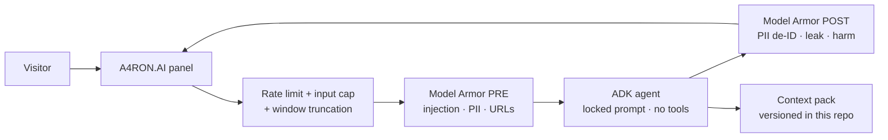
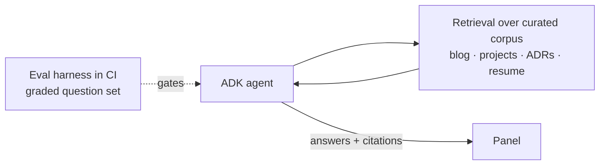
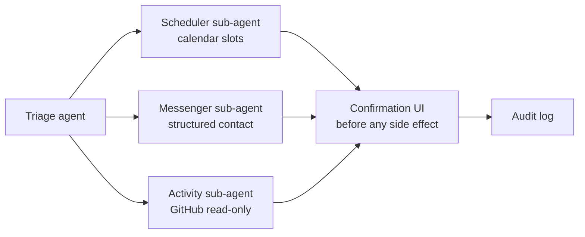

# Architecture

A4RON.AI is one ADK agent that gains capability by phase. Every phase keeps the same public contract — a single conversational endpoint consumed by the site's panel — so the front end never changes shape as the backend grows.

## Phase 1 — Concierge (current build)

The thesis phase (ADR-0003): the full defensive gateway ships even though the agent holds no secrets and no tools, because demonstrating lockdown *is* the product. Every turn passes twice through Model Armor (pre-prompt and post-response, max strictness, fail-closed), bounded by per-IP rate limits, input and output token caps, conversation-window truncation, and a hard monthly spend cutoff. No PII solicited; 7-day retention; screening verdicts logged as counts so the lockdown is measurable.

## Phase 2 — Grounded RAG

Owner-indexed corpus only — users never contribute documents, which keeps retrieval poisoning out of scope. Citations link to source pages. The eval set runs on every corpus or prompt change; regressions block deploy.

## Phase 3 — Voice

The SPEAK button activates: realtime voice sessions, push-to-talk, live transcript beside audio, the panel's EQ visualizer driven by real output. Session duration caps and the same gateway budgets apply.

## Phase 4 — Agentic actions

Untrusted input plus tools = prompt injection is now a real threat. Mitigations ship in the same phase: allowlisted tools only, nothing touching secrets or money, explicit visitor-visible confirmation before any side effect, per-session action caps, full audit trail. Multi-agent ADK layout keeps each tool's blast radius scoped to its sub-agent.

## Phase 5 — Ops

Conversation review + feedback dashboard on the isolated admin origin (shared with the site's phase-4 pattern), feedback signals feeding the eval set, model versions pinned and upgraded only through the eval gate.

## Phase R — Reserved

Numbered space held for undisclosed functionality. Extension contracts the reserved phase can rely on: (1) the gateway accepts additional routes without front-end change, (2) sub-agent registration is additive under the triage agent, (3) the context pack and eval harness version together. Whatever lands here gets threat-modeled and ADR'd before a line of code.

## Cross-phase invariants

1. **The panel is the interface** — one conversational contract, no widget, no second UX.
2. **Gateway before agent** — cost, abuse, and Model Armor screening (both directions, fail-closed) live in front of the model in every phase.
3. **Model-agnostic boundary** — the agent definition can point at Gemini or Claude without touching the site (ADR-0001).
4. **No capability without its countermeasure** — each phase ships its own security work, never borrowed from "later."
